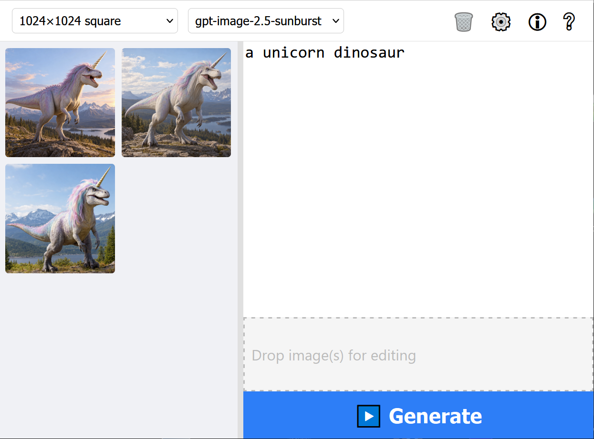

# Imaginer

Imaginer is a browser-based front end for OpenAI image generation.
Write a prompt, click **Generate**, and the image appears in the gallery.
Drop images into the prompt panel to edit them, with or without a painted mask.

Imaginer runs entirely in the browser.
There is no server, no build step, and no account besides your own OpenAI API key.
Images, prompts, masks, settings, and the API key stay in your browser storage.
The only network traffic goes to the OpenAI API.



## Features

- **Text to image**: generate one or more images per prompt with the `gpt-image-2.5` models.
- **Image editing**: drag gallery thumbnails or local image files into the drop area and describe the change.
- **Mask Mode**: paint the areas of an image that the edit may change; the rest stays untouched.
- **Streaming preview**: watch partial previews while an image renders.
- **Gallery**: thumbnails are stored in IndexedDB and persist between sessions.
- **Viewer**: full-screen view with zoom, pan, and keyboard navigation between images.
- **Import**: drop PNG, JPEG, or WebP files into the gallery; embedded prompts are read from the file metadata.
- **Export**: download single images or the whole gallery as a ZIP file.
- **Prompt embedding**: generated PNG files carry the prompt as iTXt and XMP metadata.
- **Free resolutions**: an advanced size setting allows custom sizes up to 4K on supported models.
- **Model selection**: the dropdown lists the recommended models; older models and dated snapshots can be enabled in the config.

## Requirements

- A modern browser. Imaginer is developed and tested with Firefox.
- WebGL support for the viewer and the intro sequence.
- An OpenAI API key with access to at least one `gpt-image-*` model.
- An internet connection for generation and editing.

## Getting Started

Imaginer consists of static files and ES modules.
Browsers refuse to load ES modules from `file://` URLs, so the folder must be served over HTTP.

1. Clone the repository.
   ```text
   git clone https://github.com/KaiDeMori/Imaginer.git
   cd Imaginer
   ```
2. Start any static HTTP server in the project folder. Two examples:
   ```text
   python -m http.server 8000
   ```
   ```text
   npx serve .
   ```
3. Open `http://localhost:8000` in the browser.
4. Paste your OpenAI API key into the input field, click **Test**, then click **OK**.
5. Watch the intro or skip it. The main window opens afterwards.

## Usage

- **Generate**: type a prompt in the prompt panel and click **Generate**, or press **Ctrl+Enter**.
- **Edit**: drag a thumbnail from the gallery into the drop area at the bottom of the prompt panel, type the change, click **Generate**.
- **Mask an edit**: enable Config → Generation → **Show Mask Mode Button**, open the image in the viewer, click **Mask Mode**, paint the area to change, close the viewer, then use the image for an edit.
- **Delete**: click 🗑️ in the menu bar, select thumbnails, click 🗑️ again.
- **Download**: hover a thumbnail and click ⬇️, or use Config → Files → **Download All Images**.

The full instructions are in the [User Manual](User_Manual/Imaginer_User_Manual.md).

## Configuration

Click ⚙️ in the menu bar to open the configuration dialog.
The dialog has four tabs:

- **Account**: API key test and image model refresh.
- **Generation**: number of images, parallel generation limit, background, quality, input fidelity, mask button visibility.
- **Files**: filename length, gallery export, cache refresh, gallery deletion.
- **Advanced**: older model visibility, advanced size setting, streaming preview, PNG metadata options.

Every setting is documented in the User Manual section **Configuration & Settings**.

## Data and Privacy

- Images, prompts, and masks are stored in IndexedDB.
- Settings are stored in `localStorage`.
- The API key is obfuscated and stored in `localStorage`. Anyone with access to the browser profile can recover it.
- Clearing the browser data deletes all images, settings, and the API key.
- Requests go to `api.openai.com` only.

## Documentation

- [User Manual](User_Manual/Imaginer_User_Manual.md): features, settings, and workflows.
- [FAQ](User_Manual/Imaginer_FAQ.md): common problems and quick answers.
- [Technical Manual](User_Manual/Imaginer_Technical_Manual.md): architecture, storage, API integration, keyboard reference.

## Project Structure

- `index.html`, `app.js`, `main.css`: application entry point and generation logic.
- `components/`: UI components such as the gallery, viewer, menu bar, configuration dialog, and drop areas.
- `storage/`: IndexedDB access.
- `png_iTXt/`, `png_XMP_via_iTXt/`, `strip_metadata_from_PNG/`: PNG metadata reading, writing, and stripping.
- `static_imports/`: vendored third-party libraries (JSZip, marked).
- `intro/`: the first-launch intro sequence.
- `User_Manual/`: documentation sources and the in-app help pages.
- `version_messages/`: release notes shown once per version inside the app.

## Third-Party Libraries

- [JSZip](https://stuk.github.io/jszip/) for the gallery export.
- [marked](https://marked.js.org/) for rendering the in-app documentation.

No package manager and no build tooling are required.

## Credits

Intro music credits are listed in `intro/intro_music_credits.html`.

Apart from that: Basically all frontier AI models in existence.

## License

The Imaginer source code is licensed under the [MIT License](LICENSE).
Use it, change it, and share it as you like; keep the copyright notice with the author's name in your copy.

The license covers the code and documentation of this repository only.
The vendored libraries in `static_imports/` carry their own MIT licenses.
The fonts are distributed under the SIL Open Font License.
The intro music recordings belong to their respective performers; see `intro/intro_music_credits.html`.
